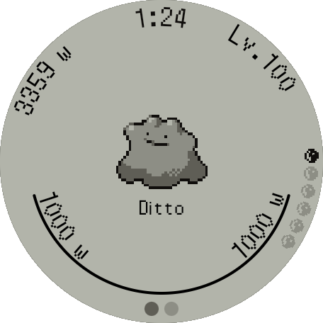
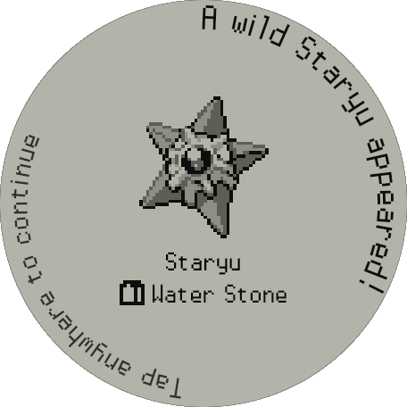
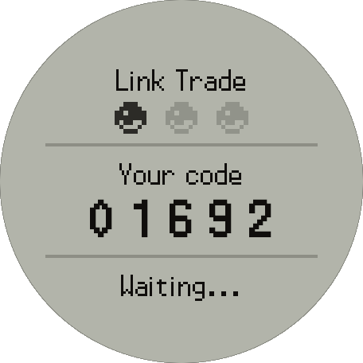

# SmartPokewalker
An expanded PokeWalker for use on WearOS.
SmartPokeWalker is a game for WearOS devices that integrates real-world movement with monster-catching gameplay. Inspired by the original PokeWalker, the app uses on-device sensors to track steps and convert physical activity into progress for training and exploration.

## Features
### **Train your Monsters**
The application accurately tracks movement and converts physical activity into in-game progress for your monsters



### **Explore and Find New Friends**
Explore to find new Monsters and train them in your party. The rest of your monsters can stay in any of your 32 boxes.


### **Extensive Monster Support**
Robust architecture for supporting different Monsters, current definitions cover Generation 4 Pokemon.



### **Wireless BLE Trading**
Trade monsters directly between smartwatches, utilizing a Bluetooth Low Energy (BLE) server, the app supports fast, reliable, and authentic local trading without requiring an internet connection.



## Build Preparation & Requirements
Graphics are not included with this project. A ROM of ***your own*** must be supplied. For testing purposes I utilize a backup of my copy of SoulSilver.

1. Place your ROM file at the `root` of the project and name it `rom.nds`

2. The script that processes the ROM requires **Python 3.7+** and the following dependencies installed through pip
```bash
$ pip install ndspy pillow
```
The images get extracted prior to the `merge` gradle task so that they can be included in the build's Resource references.

## Planned Features
* Transistion from Android Compose to KMP Compose
* WearOS complication for tracking progress on your watchface
* Support for Apple Watches
* Multiple random exploration locations 
* Import custom monsters
